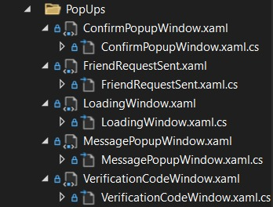
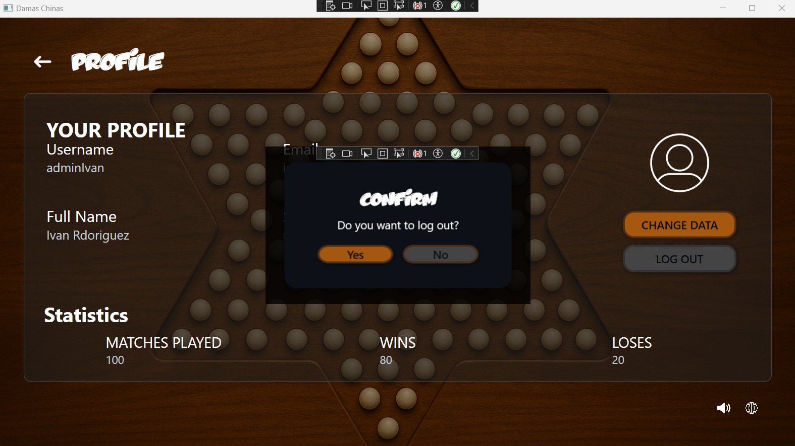
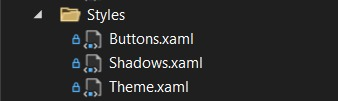
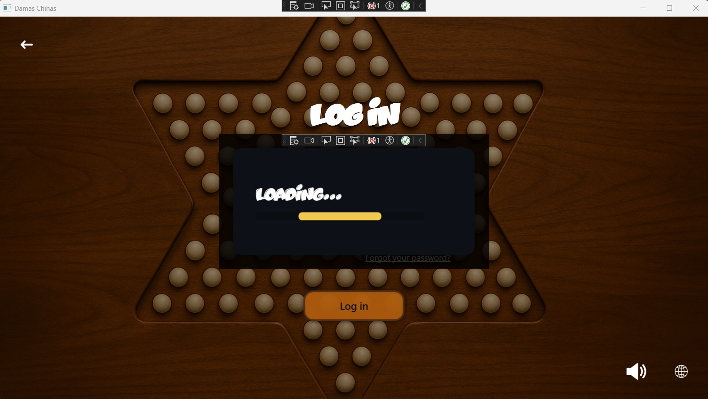
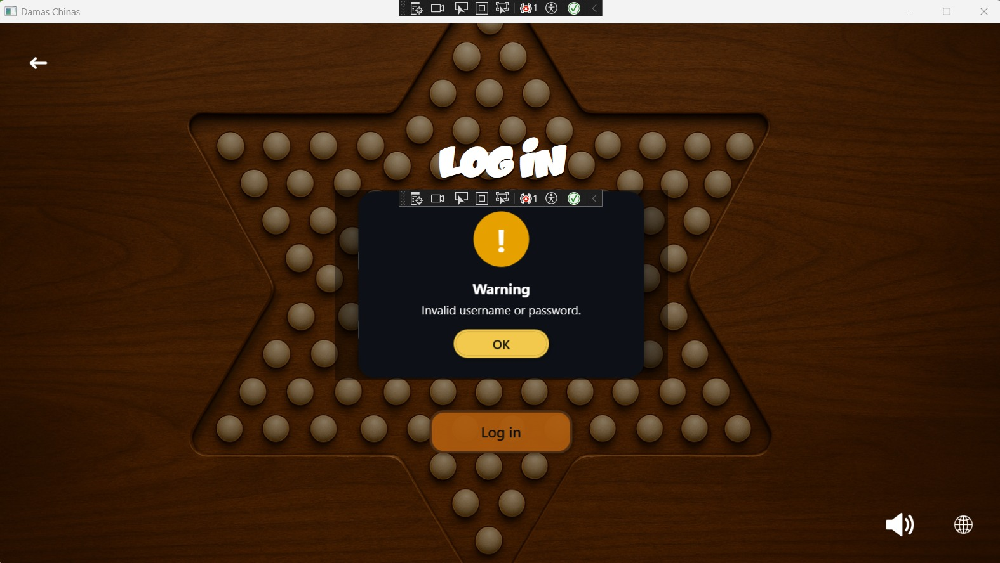
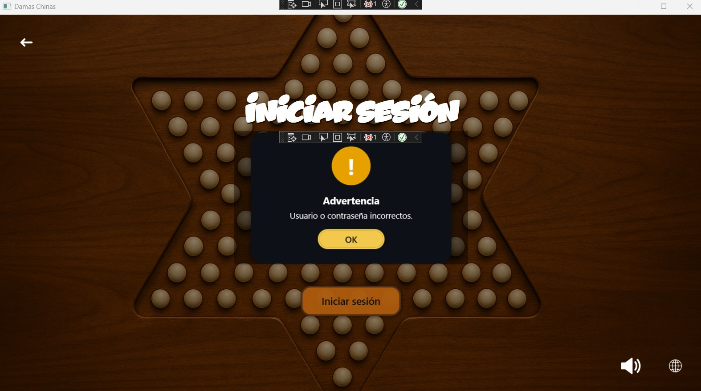
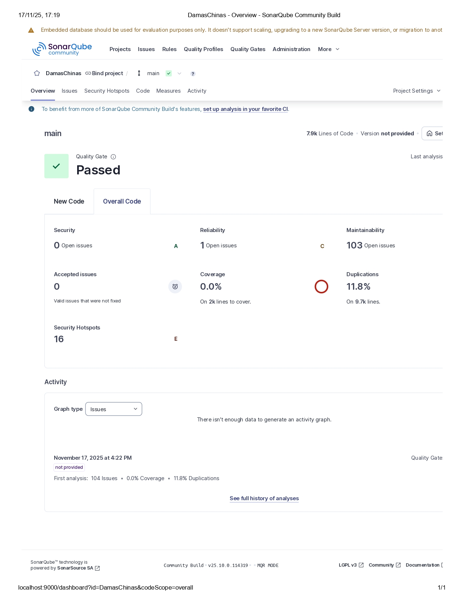

= UNIVERSIDAD VERACRUZANA
LIC. INGENIERÍA DE SOFTWARE
FACULTAD DE ESTADÍSTICA E INFORMÁTICA
:doctype: report
:toc: left
:toclevels: 3

== TECNOLOGÍAS PARA LA CONSTRUCCIÓN DE SOFTWARE

=== ACTIVIDAD: Entrega semanal de avances

*Realizado por:*  
Rodrigo Iván Ahumada Rodríguez (S21013886)  
Marquez Rodríguez Seth (S23014042)

*Docente:*  
Perez Arriaga Juan Carlos  

*Fecha de entrega:*  
Xalapa, Ver., 21 de Octubre de 2025

== Primer reporte de Avance del proyecto final: Juego Damas Chinas

=== Recursos implementados

. **Recurso de idiomas (Lang)**  
Se implementó internacionalización estática para inglés y español, lo que permite mostrar textos de la interfaz en ambos idiomas.

image::images/Lang_Rute.png[Ruta Lang , width=300]

image::images/Lang_Resource.png[Recurso Lang , width=300]

. **Carpeta Assets/Icons**  
Contiene los íconos para elementos gráficos de la interfaz, como chat, perfil, notificaciones, sonido, idioma, estadísticas, etc.

image::images/Assets_Rute.png[Recurso Assets , width=300]

. **Utilidades**  
Contiene utilidades generales que serán implementadas a lo largo del código facilitando la reutilización y estandarización.  

image::images/Validator_Rute.png[Utilidades, width=300]

.. *Correo*: módulo para facilitar el envío de correos.  

image::images/Mail_Code.png[Utilidades Correo, width=300]

.. *Hasher.cs*: encriptación de contraseñas con BCrypt.  

image::images/Hasher_Code.png[Utilidades Correo sender, width=300]

.. *Validator.cs*: utilidades de validación general.  

... Correo

image::images/Validator_Mail_Code.png[Validar correo, width_300]

... Password

image:images/Validator_Password_Code.png[Validar Password, width_300]

... Usuario

image:images/Validator_User_Code.png[Validar Password, width_300]

---

=== Ventanas desarrolladas

. *Login.xaml*  
Funcionalidad: Permite el acceso al sistema para usuarios registrados.  
Características: Validación de correo y contraseña con BCrypt.  
Internacionalización: Inglés y español.  
Estado: Funcional.

image::images/Window_Login_Spanish.png[Login Español, width=300]  
image::images/Window_Login_English.png[Login Inglés, width=300]

. *SignIn.xaml*  
Funcionalidad: Registro de nuevos usuarios.  
Características: Validación de correo y contraseñas seguras. Notificación por correo en Gmail.  
Internacionalización: Inglés y español.  
Estado: Funcional.

image::images/Window_SignIn_Spanish.png[Registro Español, width=300]  
image::images/Window_SignIn_English.png[Registro Inglés, width=300]
image::images/Example_Correo_Registro.png[Ejemplo Correo registro, width=300]

. *MainMenuRegisteredPlayer.xaml*  
Menú principal para usuarios registrados (partidas, amigos, perfil, configuración, chat y estadísticas).  
Internacionalización: Inglés y español.

image::images/Window_MainMenuRegisteredPlayer_Spanish.png[Menú Registrado Español, width=300]  
image::images/Window_MainMenuRegisteredPlayer_English.png[Menú Registrado Inglés, width=300]

. *MainMenuGuestPlayer.xaml*  
Menú principal simplificado para invitados. Acceso limitado a partidas y opciones básicas.  

image::images/Window_MainMenuGuestPlayer_Spanish.png[Menú Invitado Español, width=300]  
image::images/Window_MainMenuGuestPlayer_English.png[Menú Invitado Inglés, width=300]

. *PlayerProfile.xaml*  
Vista de perfil con estadísticas, logros e información del usuario.  

image::images/Window_PlayerProfile_Spanish.png[Perfil Jugador Español, width=300]  
image::images/Window_PlayerProfile_English.png[Perfil Jugador Inglés, width=300]

. *GuestProfile.xaml*  
Perfil básico para invitados (nombre temporal, avatar por defecto).  

image::images/Window_GuestProfile_Spanish.png[Perfil Invitado Español, width=300]  
image::images/Window_GuestProfile_English.png[Perfil Invitado Inglés, width=300]

. *FriendsList.xaml*  
Lista de amigos: agregar, eliminar, estados de conexión, mensajes.  
Estado: En construcción.  

image::images/Window_FriendsList_Spanish.png[Lista Amigos Español, width=300]  
image::images/Wnidow_FriendsList_English.png[Lista Amigos Inglés, width=300]

. *ChatWindow.xaml*  
Ventana de chat entre jugadores.  
Estado: En construcción.  

image::images/Window_ChatWindow_Spanish.png[Chat Español, width=300]  
image::images/Window_ChatWindow_English.png[Chat Inglés, width=300]

. *SelectLanguage.xaml*  
Selección de idioma (inglés/español, carga de diccionarios Lang).  
Estado: Funcional.  

image::images/Window_SelectLanguage_Spanish.png[Selección Idioma Español, width=300]  
image::images/Window_SelectLanguage_English.png[Selección Idioma Inglés, width=300]

. *MainWindow.xaml*  
Ventana base del proyecto en WPF. Punto de arranque de la aplicación.  

image::images/Window_MainWindow_Spanish.png[Ventana Principal Español, width=300]  
image::images/Window_MainWindow_English.png[Ventana Principal Inglés, width=300]

---

=== Mapeo de Base de Datos con Entity Framework

Se creó la base de datos en SQL Server Management Studio y se conectó en Visual Studio usando Entity Framework.  
Se comprobó la conexión correcta mediante autenticación en SQL Server.  

image::images/xxx.png[Entity Mapeo, width=300]

---

=== Resumen de contribución por integrante

*Integrante 1 – Rodrigo Iván Ahumada Rodríguez*  
- Diseño e implementación de vistas.  
- Creación e integración de íconos.  
- Configuración de la conexión a BD.  
- Internacionalización (50%).  
Contribución estimada: 50%.  

*Integrante 2 – Marquez Rodríguez Seth*  
- Desarrollo de la navegabilidad entre ventanas.  
- Implementación de la BD en SQL Server.  
- Implementación de utilidades: validación, encriptación, validadores.  
- Internacionalización (50%).  
Contribución estimada: 50%.  

*Nota:* El equipo considera que ambas contribuciones son complementarias (uno enfocado en capa visual y BD, el otro en lógica de validación y soporte multilenguaje).

== Uso de Inteligencia Artificial (IA)

El equipo definió reglas para un uso responsable:  

* Permitido: consultar sobre tecnologías y ventajas.  
* Permitido: ejemplos generales de implementación.  
* No permitido: pedir desarrollo completo de módulos.  
* Permitido: compartir código propio para revisión y comentarios.  
* Prohibido: usar código generado por IA que no se entienda.  

---

== Segundo reporte de Avance del proyecto final: Juego Damas Chinas

== Server
image::images/Server_Rute.png[Directorio server, width=300]

image::images/Evicence_RunServices_global.png[Directorio server, width=300]

=== AccountManager.cs
image::images/AcountManager_Service_Evidence.png[Directorio server, width=600]

==== DataContracts
- **PublicProfile**
    - Representa la información pública de un usuario.
    - Campos:
        - **`Username`** (string) – nombre de usuario del perfil.
        - **`Nombre`** (string) – nombre propio del usuario.
        - **`LastName`** (string) – apellido del usuario.
        - **`Correo`** (string) – correo del usuario.
        - **`Telefono`** (string) – teléfono registrado del usuario.

- **UsuarioInfo**
    - Representa la información de un usuario dentro de una operación.
    - Campos:
        - **`IdUsuario`** (int) – identificador del usuario.
        - **`Username`** (string) – nombre de usuario.
        - **`Correo`** (string) – correo del usuario.
        - **`NombreCompleto`** (string) – concatenación de nombre y apellido.

- **ResultadoOperacion**
    - Representa el resultado de una operación de modificación de datos.
    - Campos:
        - **`Exito`** (bool) – indica si la operación fue exitosa.
        - **`Mensaje`** (string) – descripción del resultado.
        - **`Usuario`** (UsuarioInfo) – información del usuario afectado (opcional, puede ser null).

==== Servicios
- **IAccountManager** (ServiceContract)
    - Define las operaciones expuestas por el servicio WCF **AccountManager**.
    - Operaciones (OperationContract):
        - **`PublicProfile ObtenerPerfilPublico(int idUsuario)`**
        - **`ResultadoOperacion CambiarUsername(int idUsuario, string nuevoUsername)`**
        - **`ResultadoOperacion CambiarPassword(int idUsuario, string nuevaPassword)`**

==== Operaciones / Funcionalidad
1. **ObtenerPerfilPublico(int idUsuario)**
   - Función: Devuelve la información pública de un usuario.
               Internamente delega la obtención a **RepositorioUsuarios.ObtenerPerfilPublico**.
   - Retorna: **PublicProfile** (DataContract)
   - Retorna **null** si el usuario no existe.

2. **CambiarUsername(int idUsuario, string nuevoUsername)**
   - Función: Modifica el nombre de usuario de un usuario.
               Delegado a **RepositorioUsuarios.CambiarUsername**, que valida el username.
   - Retorna: **ResultadoOperacion** (DataContract)
       - **`Exito`**, **`Mensaje`**, **`Usuario`** (actualmente null)

3. **CambiarPassword(int idUsuario, string nuevaPassword)**
   - Función: Modifica la contraseña de un usuario.
               Delegado a **RepositorioUsuarios.CambiarPassword**, que valida la contraseña.
   - Retorna: **ResultadoOperacion** (DataContract)
       - **`Exito`**, **`Mensaje`**, **`Usuario`** (actualmente null)

=== LoginService.cs

image::images/LoginService_Service_Evidence.png[Directorio server, width=600]

==== DataContracts
- **LoginResult**
    - Representa el resultado de la validación de login de un usuario.
    - Campos:
        - **`IdUsuario`** (int) – identificador del usuario.
        - **`Username`** (string) – nombre de usuario del perfil.
        - **`Success`** (bool) – indica si la validación fue exitosa.

==== Servicios
- **ILoginService** (ServiceContract)
    - Define las operaciones expuestas por el servicio WCF **LoginService**.
    - Operaciones (OperationContract):
        - **`LoginResult ValidarLogin(string usuarioInput, string password)`**

==== Operaciones / Funcionalidad
1. **ValidarLogin(string usuarioInput, string password)**
   - Función: Valida las credenciales de un usuario.
               Internamente delega la operación a **RepositorioUsuarios.ObtenerLoginResult**.
   - Retorna: **LoginResult** (DataContract)
       - **`IdUsuario`**, **`Username`**, **`Success`**
   - Validación mínima: Se asegura de que los parámetros no estén vacíos dentro del repositorio.

=== SingInService.cs

image::images/SingInService_Service_Evidence.png[Directorio server, width=600]

==== DataContracts
- **UsuarioInfo**
    - Representa la información de un usuario dentro de una operación.
    - Campos:
        - **`IdUsuario`** (int) – identificador del usuario.
        - **`Username`** (string) – nombre de usuario.
        - **`Correo`** (string) – correo del usuario.
        - **`NombreCompleto`** (string) – concatenación de nombre y apellido.

- **ResultadoOperacion**
    - Representa el resultado de una operación sobre datos de usuario.
    - Campos:
        - **`Exito`** (bool) – indica si la operación fue exitosa.
        - **`Mensaje`** (string) – descripción del resultado o error.
        - **`Usuario`** (UsuarioInfo) – información del usuario afectado (opcional, puede ser null).

==== Servicios
- **ISingInService** (ServiceContract)
    - Define las operaciones expuestas por el servicio WCF **SingInService**.
    - Operaciones (OperationContract):
        - **`ResultadoOperacion CrearUsuario(string nombre, string apellido, string correo, string password, string username)`**

==== Operaciones / Funcionalidad
1. **CrearUsuario(string nombre, string apellido, string correo, string password, string username)**
   - Función: Crea un nuevo usuario junto con su perfil asociado.
               Internamente delega la operación a **RepositorioUsuarios.CrearUsuario**, 
               que realiza todas las validaciones de nombre, apellido, correo, username y contraseña.
   - Retorna: **ResultadoOperacion** (DataContract)
       - **`Exito`** – true si se creó correctamente.
       - **`Mensaje`** – mensaje de éxito o error.
       - **`Usuario`** – **UsuarioInfo** con los datos del usuario creado.
   - Envío de correo de bienvenida: Opcionalmente envía un email en segundo plano tras la creación del usuario.
   - Validación: Todas las validaciones se realizan en **RepositorioUsuarios**, no en el servicio.

=== Logica

==== RepositorioUsuarios.cs 

1. **CrearUsuario(string nombre, string apellido, string correo, string password, string username)**
   - Función: Crea un nuevo usuario junto con su perfil asociado en la base de datos.
               Antes de guardar, valida los datos usando la clase **Validator**:
                 - Nombre y apellido → **Validator.ValidarNombre**
                 - Correo → **Validator.ValidarCorreo**
                 - Username → **Validator.ValidarUsername**
                 - Contraseña → **Validator.ValidarPassword**
   - Retorna: usuarios (entidad creada con su perfil agregado).
   - Excepciones: Lanza excepción si ya existe el correo o el username, 
                  o si algún dato no cumple las reglas de validación.

2. **ObtenerLoginResult(string usuarioInput, string password)**
   - Función: Valida las credenciales de un usuario y retorna información básica para login.
               Realiza validación mínima de que los parámetros no estén vacíos.
   - Retorna: **LoginResult**
     - **`IdUsuario`**, **`Username`**, **`Success`**
   - Excepciones: Lanza excepción si **usuarioInput** o **password** están vacíos.

3. **ObtenerPerfilPublico(int idUsuario)**
   - Función: Obtiene la información pública de un usuario a partir de su id.
   - Retorna: **PublicProfile** (datos como username, nombre, apellido, correo y teléfono).
   - Retorna **null** si el usuario no existe.

4. **CambiarUsername(int idUsuario, string nuevoUsername)**
   - Función: Actualiza el nombre de usuario de un perfil.
               Antes de modificarlo, valida el username usando:
                 - **Validator.ValidarUsername**
   - Retorna: **bool** – `true` si la operación fue exitosa.
   - Excepciones: Lanza excepción si el username ya existe, el perfil no se encuentra, 
                  o el username no cumple las reglas de validación.

5. **CambiarPassword(int idUsuario, string nuevaPassword)**
   - Función: Actualiza la contraseña de un usuario.
               Antes de modificarla, valida la contraseña usando:
                 - **Validator.ValidarPassword**
   - Retorna: **bool** – `true` si la operación fue exitosa.
   - Excepciones: Lanza excepción si el usuario no existe o la contraseña no cumple las reglas de validación.

=== IMPLEMENTACION

image::images/Cliente/EvidenceServices.png[Directorio server, width=600]

=== SingIn

image::images/SingInUi/Base.png[Directorio server, width=600]

image::images/SingInUi/BaseErrorContraseñaInsegura.png[Directorio server, width=600]

image::images/SingInUi/BaseExito.png[Directorio, width=600]

=== MenuRegisteredPlayer

image::images/MenuRegisteredPlayer/Base.png[Directorio, width=600]

=== ProfilePlayer

image::images/ProfilePlayer/Base.png[Directorio, width=600]

=== ChangeData

image::images/ChangeData/Base.png[Directorio, width=600]

image::images/ChangeData/BaseUsernameExito.png[Directorio, width=600]

image::images/ChangeData/BaseExitoContraseña.png[Directorio, width=600]

==== Evidencia posterior al cambio

image::images/ChangeData/PruebaExito.png[Directorio, width=600]

== DOCUMENTACION 

Elaboración de un documento de **AsciiDoc** para facilitar el control y registro de los cambios realizados con cada entrega.

image::images/EvidenceAsciiDoc.png[Directorio server, width=600]

== Avance del Proyecto Final: Juego Damas Chinas (Entrega 2)

=== SETH
- **Creación del server:** 100%
- **Implementación de servicios en el cliente:** 100%
- **Creación de documento ASCII-DOC:** 60%
- **Conexión de Cliente con Host:** 100%

=== IVAN
- **GUI:** 100%

== Tercer reporte de entrega

=== Modificaciones a la BD

En busqueda de mantener la persistencia de los mensajes existentes en un chat de amigos se implemento la siguiente tabla en la base de datos, con la finalidad de no saturar la memoria del servidor para acceder a las platicas.

image::images/BD/MensajesBd.png[Evidencia Funcionamiento, width=600]

=== Cliente

==== CHAT

Funcionalidad: Guardar Mensajes entre amigos.  
Características: Muestra de forma dinamica la recepcion de mensajes manteninedo chats individuales entre amigos. 
Internacionalización: Inglés y español.  
Estado: En proceso, la mensajeria funciona pero el callback que actualiza al llegar un nuevo mensaje aun no esta del todo funcional

image::images/chat/FunctionalEvidence.png[Evidencia Funcionamiento, width=600]

**Fucionalidad**

image::images/chat/XAMLchat.png[Explicacion Funcionamiento, width=600]

AL iniciar la ventana de chat, se recurre a la interfaz *MesageService* misma que se encarga de consultar los mensajes existentes entre 2 usuarios y agregarlos a una coleccion de mensajes misma que sera mostrada automaticamente por la page.

image::images/chat/Cargadelosdatos.png[Explicacion Funcionamiento2, width=600]

==== Friends

image::images/Friends/Evidencia1.png[Evidencia friends, width=600]

Funcionalidad:

- Mostrar la lista de amigos  
- Permite la apertura de un chat con amigos
- Nos permite consultar el perfil publico de nuestros amigos

Características: Al entrar en la ventana se recupera la lista de amigos del usuario y los despliega por medio de una lista de amigos provista por el servidor

image::images/Friends/DTOFriend.png[Evidencia friends, width=600]

Y lo muestra por medio de un  ItemControl Para mantener la estetica de nuestras ventanas y permiten la creacion de botones dinamicos para cada uno de los amigos.

image::images/Friends/ItemControl.png[Evidencia ItemList, width=600]

=== Servidor

**Evidencia Servicios Corriendo**

image::images/Server/EvidenciaRunService.png[RunService width=600]

==== AmistadService

*Funcionalidades y estado.*

image::images/Server/FrienService/HttpEvidence.png[HttpEvidence  width=600]

Este servicio es el encargado de todo lo relacionado a la gestion de amigos.

- Mostrar Lista de Amigos (Funcional)
- Agregar amigo (pendiente de implementacion)
- Eliminar amigo (pendiente de implementacion)
- Bloquear usuario (pendiente de implementacion)

image::images/Server/FrienService/eVIDENCIA1.png[Evidencia1 ItemList, width=600]

image::images/Server/FrienService/ServiceContract.png[ServiceContract , width=600]

image::images/Server/FrienService/dto.png[ServiceContract , width=600]

==== MessageService

Este servicio es el encargado de todo lo relacionado a la entrega de mensajes entre amigos para el chat

**DTO**

image::images/Server/MensajeriaService/Dto.png[dto servicemesage , width=600]

**ServiceContract**

image::images/Server/MensajeriaService/ServiceContract.png[ ServiceContract , width=600]

**Service**

image::images/Server/MensajeriaService/service.png[ ServiceContract , width=600]

**UtilidadesImplementadas**

encargadas de mediar la logica entre el servidor y la implementacion de entity framework 

image::images/Server/MensajeriaService/Utilidades.png[ ServiceContract , width=600]

==== LOBBY

Funcionalidad: Creación, unión y gestión dinámica de lobbies multijugador.

Características: Permite la creación de lobbies privados o públicos por parte del usuario anfitrión, la unión de otros jugadores mediante un código de invitación, y la comunicación en tiempo real entre los miembros de un mismo lobby. 

Internacionalización: Inglés y español.  
Estado: **En funcionamiento.** El cliente y servidor ya se comunican correctamente mediante WCF, el *LobbyManager* del cliente está implementado y los servicios del servidor están en ejecución estable.

---

**Descripción de la implementación**

La estructura del sistema se divide en **Cliente (UI)** y **Servidor (WCF Services)**.  
El *Cliente* utiliza el proxy `LobbyServiceProxy` generado automáticamente desde el servicio del servidor para gestionar la comunicación, mientras que el *Servidor* expone la lógica de negocio a través del contrato `ILobbyService` y el *callback contract* `ILobbyCallback`.

image::images/Lobby/LobbyServiceProxy.jpg[Evidencia funcionamiento Lobby, width=600]

---

**Estructura del Servidor**

- **Carpeta Dtos:** contiene las clases `Lobby`, que representan la sesión multijugador y los jugadores conectados.
- **Carpeta Interfaces:** define `ILobbyService` (contrato principal) e `ILobbyCallback` (canal de retorno que notifica eventos a los clientes).
- **Carpeta Services:** contiene `LobbyService.cs`, que implementa toda la lógica del sistema de lobbies.

image::images/Lobby/LobbyDtos.jpg[Evidencia funcionamiento Lobby, width=600]

image::images/Lobby/LobbyInterface.jpg[Evidencia funcionamiento Lobby, width=600]

image::images/Lobby/LobbyServices.jpg[Evidencia funcionamiento Lobby, width=600]

---

**ServiceContract y Callback**

El servidor implementa las siguientes operaciones mediante WCF:

- `CreateLobby(hostUserId, hostUsername, isPrivate)` → crea un nuevo lobby y registra al host.
- `JoinLobby(code, userId, username)` → permite a un jugador unirse mediante el código.
- `LeaveLobby(code, userId)` → remueve al jugador del lobby.
- `SendLobbyMessage(code, userId, username, message)` → envía mensajes a todos los miembros conectados.
- `StartGame(code)` → notifica a todos los jugadores que la partida ha comenzado.

El `ILobbyCallback` define los métodos que el servidor invoca en los clientes:
- `OnMemberJoined(LobbyMember member)`
- `OnMemberLeft(int userId)`
- `OnMessageReceived(int userId, string username, string message, string utcIso)`
- `OnLobbyClosed(string reason)`
- `OnGameStarted(string code)`

---

**Estructura del Cliente**

El cliente cuenta con una capa de utilidades (`Utilities`) que maneja la conexión con los servicios del servidor y los eventos recibidos por medio de callbacks.

- **LobbyManager.cs**: clase encargada de gestionar la conexión con el servicio `LobbyService`, utilizando el proxy generado por *Connected Services*.  
- Implementa la interfaz `ILobbyServiceCallback` para recibir las notificaciones del servidor en tiempo real.  
- Expone eventos públicos (`MemberJoined`, `MemberLeft`, `MessageReceived`, `LobbyClosed`, `GameStarted`) a los que la UI puede suscribirse para actualizar las vistas.

---

**Flujo de comunicación**

1. El usuario crea o se une a un lobby desde la interfaz WPF.
2. `LobbyManager` crea una instancia de `LobbyServiceClient` con un `InstanceContext` para manejar los callbacks.
3. El servicio `LobbyService` en el servidor agrega el usuario al lobby y notifica al resto mediante `OnMemberJoined`.
4. La UI del cliente actualiza la vista de jugadores conectados automáticamente mediante eventos suscritos.

---

==== Avance del Proyecto Final: Juego Damas Chinas (Entrega 3)

=== SETH
- **Creacion e implementacion de el servicio de mensajes:** 100%
- **Creacion del servicio de amigos** 100%
- **Creacion del servicio de mensajes** 100%
- **Creación de documento ASCII-DOC:** 50%
- **Implemtacion de servicio amigos en cliente** 100%
- **Implementacion de servicio de mensajes en cliente* 100%
- **Modificacion de la base de datos** 50%

=== IVAN
- **GUI:** 100%
- **Creacion e implementación del servicio de Lobby de juego** 100%
- **Creación de documento ASCII-DOC:** 50%
- **Implementacion de servicio de lobby en cliente** 100%
- **Modificacion de la base de datos** 50%

== Cuarto reporte de avance del proyecto final: Juego Damas Chinas
---

=== Cliente

==== Creación y Refactorización de Nuevas Páginas XAML

 
A continuación se enlistan **todas las ventanas XAML** que fueron creadas, actualizadas o refactorizadas durante esta semana:

- Friends.xaml  
- ChatWindow.xaml  
- PreLobby.xaml  

- ChangeData.xaml  
- SignIn.xaml  
- MenuRegisteredPlayer.xaml  
- ProfilePlayer.xaml  
- Componentes de Popups (PopupError.xaml, PopupWarning.xaml, PopupSuccess.xaml)  
- LoadedBar.xaml (nuevo componente)  
- Archivos de estilos globales (Buttons.xaml, TextBoxes.xaml, Cards.xaml, Colors.xaml, GeneralTheme.xaml)  

Durante esta entrega, todas estas vistas recibieron mejoras orientadas a la estandarización visual y técnica del proyecto. Se eliminaron textos hardcodeados para reemplazarlos por claves internacionalizadas, se reorganizó la estructura visual siguiendo el estándar interno, se aplicaron nuevos estilos globales unificados, se corrigieron bindings, se integró el nuevo sistema de popups, se añadió soporte para la barra de carga (LoadedBar) en vistas clave y se ordenaron los recursos utilizados por cada ventana. Estos cambios garantizan coherencia gráfica, mantenibilidad, escalabilidad y una experiencia de usuario más fluida.

---

==== Implementación de Popups Reutilizables

Durante esta semana se consolidó un sistema de ventanas emergentes (popups) completamente modular, orientado a sustituir cualquier uso directo de `MessageBox` o mensajes hardcodeados. Los popups fueron integrados con los estilos globales del proyecto, con el sistema de internacionalización y con el controlador unificado de mensajes.

Las ventanas emergentes creadas o ajustadas durante esta entrega son las siguientes:

- ConfirmPopupWindow.xaml  
- FriendRequestSent.xaml  
- LoadingWindow.xaml  
- MessagePopupWindow.xaml  
- VerificationCodeWindow.xaml  

Este sistema unificado permite que cualquier ventana del proyecto utilice popups estilizados, sin hardcode y totalmente coherentes con el estándar visual y funcional del proyecto.

---

==== Nuevos Estilos Globales (WPF)

Uno de los avances más importantes fue la creación y reorganización de estilos globales para toda la UI: botones, tarjetas, inputs, temas y colores.

---

==== LoadedBar Utility (Barra de Carga)

Se implementó la barra **LoadedBar**, utilizada para representar operaciones del servidor que requieren tiempo (por ejemplo, carga de inicio de sesión o registro).

Esta utilidad es completamente modular y reutilizable.

---

==== Sistema de Internacionalización Sin Hardcode

Se completó la integración del sistema estandarizado que reemplaza completamente el uso de textos directos (hardcode) tanto en la interfaz como en la lógica del cliente.  
El flujo completo de un mensaje ahora funciona así:

**MessageCode (Servidor) → MessageTranslator (Cliente) → MessageHelper → Diccionario de recursos → Popup/UI**

Este flujo garantiza coherencia, escalabilidad y soporte multilenguaje en toda la aplicación.

===== MessageCode  

El servidor nunca envía textos.  
Cada operación devuelve únicamente un `MessageCode`, lo que evita inconsistencias y permite que el cliente controle completamente la presentación de los mensajes.

===== MessageTranslator  

El `MessageTranslator` es el componente responsable de convertir un `MessageCode` en el texto correspondiente según el idioma activo del sistema.  
Este traductor consulta los diccionarios de recursos (`Lang.en.xaml`, `Lang.es.xaml`) y retorna el texto final que debe mostrarse.  
Gracias a este componente, ninguna vista ni lógica del cliente necesita conocer claves ni diccionario: solo recibe la traducción ya lista.

===== MessageHelper  

El `MessageHelper` es la capa que usa la traducción generada por `MessageTranslator` y decide **cómo mostrarla** en la interfaz.  
Es el encargado de:

- Mostrar el popup correspondiente (éxito, advertencia o error).  
- Aplicar estilos globales.  
- Centralizar toda la lógica de visualización de mensajes.  
- Evitar duplicación de código en cada ventana.  
- Asegurar que todos los mensajes pasen por el mismo proceso estándar.

En otras palabras, **MessageTranslator resuelve qué mensaje mostrar y MessageHelper decide cómo mostrarlo**.

===== Diccionarios de idioma reorganizados  

Los archivos de idioma fueron reorganizados y estructurados por claves relacionadas con los códigos del servidor.  
Esto permite incorporar fácilmente nuevos mensajes o modificar textos sin tocar la lógica del cliente.

Con este sistema, toda la interfaz queda completamente preparada para soportar cualquier idioma y garantiza que todos los mensajes visibles cumplan con el estándar del proyecto, sin hardcode y con una experiencia consistente en todas las vistas.

---

==== Corrección Formal del Manejo de Excepciones

Se reemplazó por completo:

- `catch(Exception)`
- Mensajes escritos directamente en UI
- MessageBox directos

por un sistema basado en:

- `OperationResult`
- `MessageHelper`
- `MessageTranslator`
- `TryExecuteAction()`

---

==== Preparación del Entorno de Análisis con SonarQube

Durante esta semana no se aplicaron correcciones derivadas de SonarQube; sin embargo, se realizó toda la preparación necesaria para habilitar el análisis de calidad del código del proyecto. Esto incluyó la instalación de SonarQube Community Edition, su configuración local, la habilitación del servicio en el sistema y la integración del proyecto Damas Chinas a través de una clave de proyecto y token de autenticación.

Asimismo, se instaló y configuró **SonarScanner for MSBuild**, permitiendo ejecutar análisis completos de la solución desde la consola de Visual Studio. Con esto, el proyecto queda listo para comenzar a detectar code smells, duplicaciones, problemas potenciales de mantenibilidad y violaciones al estándar de codificación en futuras iteraciones.

---

=== Resumen de contribución por integrante

==== Rodrigo Iván Ahumada Rodríguez

Durante esta semana se avanzó significativamente en la interfaz del cliente y en la estructura interna del proyecto. Se completó la creación y refactorización de múltiples ventanas XAML, asegurando el cumplimiento del estándar interno de diseño, eliminando hardcode visual y organizando los componentes para que su mantenimiento sea más claro y escalable. También se implementó un sistema completo de popups reutilizables, con soporte para internacionalización y estilos globales.

Asimismo, se integró la barra de carga (LoadedBar) como componente reutilizable para operaciones remotas, se reorganizó la estructura de recursos (imágenes, diccionarios y estilos) y se completó el sistema de internacionalización basado en MessageCode, MessageTranslator y MessageHelper. Se corrigió el manejo de mensajes visibles al usuario, centralizando todo en una lógica común.

Finalmente, se realizó toda la preparación del entorno de análisis de calidad utilizando SonarQube, incluyendo su instalación, configuración inicial, generación del token de proyecto y la integración con SonarScanner para ejecutar análisis locales. Esto deja el proyecto listo para comenzar con correcciones de calidad en futuras entregas.

- Refactor y creación de múltiples ventanas XAML → **100%**
- Implementación del sistema centralizado de popups → **100%**
- Integración del sistema de internacionalización sin hardcode → **100%**
- Implementación de LoadedBar como componente reutilizable → **100%**
- Reorganización de recursos y estilos globales → **100%**
- Manejo unificado de mensajes con MessageCode → **100%**
- Preparación completa del entorno de análisis SonarQube → **100%**

